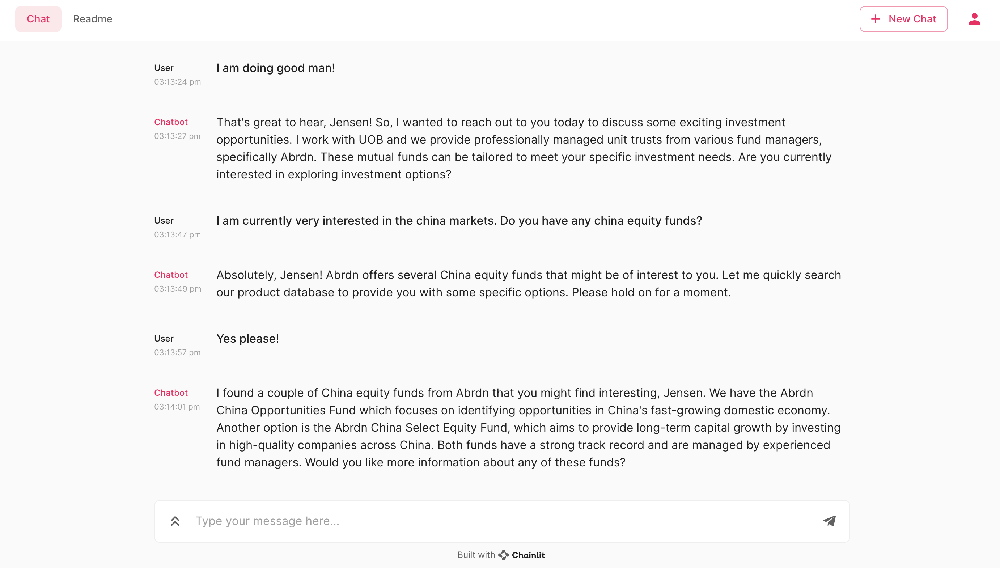
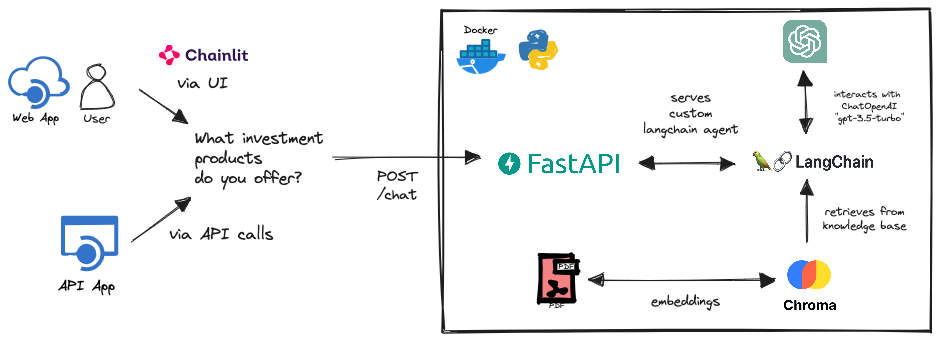

# InvestmentAdvisorGPT

> Your friendly investment advisor has now turned into an LLM chatbot!

This project demonstrates the usage of custom agent with knowledge base and tools to generate insightful conversations with regards to investment-related topics and products.

The chatbot demonstrated in this repo exhibits certain persona [defined](./src/model/templates/tools.py) aimed to conduct a sale outreach with users in attempt to promote and pitch certain financial products e.g., mutual funds embedded within our knowledge base. Conversation flows are also depended on previous conversation history. The attempt to generate context-aware sales conversation is adapted from [SalesGPT](https://github.com/filip-michalsky/SalesGPT), where the chatbot has the ability to shift conversation topics with minimal prompting from the user.

## Installation

The application consisting of the UI and server is container-ready and deployed via the [docker-compose](docker-compose.yaml) file.

To start the application, simply use the following command:

```docker
docker-compose up -build
```

To stop the application and clean up, use the following command:

```docker
docker-compose down --remove-orphans
```

### Tools and LLM Setup

To ensure the full working experience of the chatbot, you will need to have the following API keys:

1. **OpenAI** via @ https://platform.openai.com/
   - This powers the underlying LLM model (`ChatOpenAI`).
2. **Serper** via @ https://serper.dev/
   - This powers the underlying web search capability (`GoogleSerperAPIWrapper`)

Once you have obtained the relevant API keys, you can stored them in a [.env](./.env) file, in the following format:

```
OPENAI_API_KEY="fill me in"
SERPER_API_KEY="fill me in"
```

## Quick Start
Using your terminal:
```bash
# user_id can be anything, it just to use to create
# and identify your agent to retrieve relevant conversation history/context
export user_id="jensenlwt"

# initial message is empty as the bot will chat with you first
curl -X POST http://localhost:8000/chat/$user_id \
     -H "Content-Type: application/json" \
     -d '{"message": ""}'

>>> {
    "user_id":"jensenlwt",
    "raw_message":"Bobby Axelrod: Hi Jensen! How are you doing today? <END_OF_TURN>"
    }

# asking about new opportunities
curl -X POST http://localhost:8000/chat/$user_id \
     -H "Content-Type: application/json" \
     -d '{"message": "I am doing good Bobby! Do you have any new investment opportunities for me?"}'

>>> {"user_id":"jensenlwt",
    "raw_message":"Bobby Axelrod: Hi Jensen! I'm glad to hear that you're doing good. Yes, I do have some exciting new investment opportunities for you. We have recently launched various mutual funds from Abrdn that might be of interest to you. These funds are professionally managed by different fund managers and designed to meet your specific investment needs. Would you like me to provide more information about these funds? <END_OF_TURN>"
}

# seeking new information
curl -X POST http://localhost:8000/chat/$user_id \
     -H "Content-Type: application/json" \
     -d '{"message": "Sure! can you kindly provide me with more information?"}'

>>> {
  "user_id": "jensenlwt",
  "raw_message": "Bobby Axelrod: Absolutely, Jensen! Here are a few mutual funds from Abrdn that you might find interesting:\n\n1. Abrdn Global Technology Fund: This fund focuses on investing in global technology companies, aiming to capitalize on advancements in the tech sector.\n\n2. Abrdn Emerging Markets Equity Fund: This fund targets emerging market economies and invests in high-potential companies within those markets, aiming for long-term capital growth.\n\n3. Abrdn Sustainable Equity Fund: This fund invests in companies that actively contribute to sustainable development and environmental responsibility, aiming to generate both financial returns and positive impact.\n\n4. Abrdn Global Bond Fund: This fund focuses on fixed-income securities from around the world, aiming to provide stable income and potential capital appreciation.\n\nThese are just a few options available, Jensen. Let me know if any of these funds caught your interest, or if you'd like more information on any specific one. <END_OF_TURN>"
}
```

#### UI



In addition to using API calls, a UI is provided. The UI is developed using [Chainlit](https://docs.chainlit.io/overview) that allows for fast iteration when building LLM app interfaces.

To visit the UI, you may access @ http://localhost:8080 after completing the relevant [installation](#installation).

## Architecture

The overall architecure of the application is as observed:



### Conversation Context

The `InvesmentAdvisorGPT` agent has requires some configs to power basic conversation capability. The require configs are:

```json
{
    "advisor_name": "Bobby Axelrod",
    "advisor_role": "private wealth advisor",
    "nationality": "Singaporean",
    "formal_language": "english",
    "informal_language": "singlish",
    "company_name": "UOB",
    "company_business": "provide unit trusts professionally managed by various fund managers, designed to meet customers' specific investment needs",
    "conversation_purpose": "find out if the prospect is interested in the latest investment products, specifically various mutual funds from Abrdn",
    "conversation_type": "text",
    "source_of_contact": "investment seminar",
    "prospect_name": "Jensen Low",
    // these below can remain untouched
    "conversation_stage": "Introduction: Begin the cold call with a warm self-introduction. Include your name, company, and a credibility statement or reason for the prospect to stay engaged.",
    "conversation_history": [],
    "use_tools": true,
    "verbose": true
}
```

**Explaination of Configs:**

1. `advisor_name`: Name of your agent, so it doesn't address itself as a robot/llm.
2. `advisor_role`: Role for your agent, so it knows it should behave in the capacity of the role.
3. `nationality`: Attempt to enforce behaviour from a nationality (doesn't seem to work as expected, lacklustre)
4. `formal_language` and `informal_language`: Attempt to allow for a switch-up the way the conversational tone sounds depending on the context of the conversation (fluctuate between being very professional and too overly casual (e.g., `"hey bro!"`, `"... bro!"`))
5. `company_name` and `company_business`: Allows the agent to identify himself appropriate or introduces himself by identifying his work association.
6. `conversation_purpose`: Drives the overall objective of the conversation and all conversation flow stems from the purpose.
7. `source_of_contact` and `prospect_name`: Refers to the user we are reaching out to/or reaching out to us. This attempts to ground the agent with regards to a certain level of familarity with the user and not hallucinating and making the premise of the conversation random.

Lastly, `conversation_history`, `conversation_stage` seeds the initial conversation. While `use_tools` controls whether to use a agent with tools (product search, web search) or just default prompts (greater potential to hallucinate), and `verbose` set the verbosity of the Agents.

#### Change In Conversation Flow

As demonstrated in [SalesGPT](https://github.com/filip-michalsky/SalesGPT), custom agents can have the ability to change conversational topics or guide the flow of conversation if the conversation history is analyzed and identified for what stage a sales call might be in. Adapting the ideas, a series of [conversation stages](./src/model/templates/chains.py) were determined based on several research on cold-calls strategy and workflow to better capture how the conversation might panned out.

The stages are as followed:

1.  **Introduction:** Begin the cold call with a warm self-introduction. Include your name, company, and a credibility statement or reason for the prospect to stay engaged.
2.  **Confirm:** This is an important next stage right after [Introduction] to confirm if the prospect is the right person to discuss financial products/services. Check their age and authority for making financial decisions."
3. **Understanding the Prospect (Repeatable):** Ask open-ended questions multiple times to uncover the prospect's financial needs and situation. Repeat this stage until you have gathered sufficient background information. Attempt to figure out what life stage they are currently in, and if they have any major life events happening soon that may impact their finances. Listen attentively. You are to infer the prospect's financial ability in terms of income, expenditure and financial aspiration.",
4. **Huge Claim:** Present an attention-grabbing claim related to the product/service. Connect it to the prospect's background in [Understanding the Prospect] discussed earlier.
5. **Product Introduction:** Introduce some of the products you have that may best suit the prospect's background and needs (inferred in from [Understanding the Prospect]). If unsure of their needs, repeat [Understanding the Prospect] and ask more questions to generate a more informed understanding of the prospect.
6. **Value Proposition:** Explain how our financial products/services benefit the prospect. Focus on their needs and emphasize unique selling points.",
7. **Addressing Doubts:** Handle skepticism about previous claims or product presentation. Provide evidence or testimonials.
8. **Closing:** If the prospect is demonstrating keenness/enthuasisiam in your financial products/services, invite the prospect for a further discussion or meeting. Suggest potential dates and times.
9. **End conversation:** The prospect has to leave to call, the prospect is not interested, or next steps where already determined by the sales agent.

A chain (`ConversationStageAnalyzerChain`) is designed to analyzed the conversation history up till the latest point and retrieve the most relevant stage and feed back into the agent's prompt as a guideline on how to response.

### Knowledge Base and Tools

To miminize hallucination from our agent, we also utilised a knowledge base based on embeddings generated from various investment-related documents. Referring to the architecture [diagram](#architecture), you can see that the agent leverages retrieval from the knowledge based to augment its thoughts and responses.

These documents used include prospectus sheet, product highlight sheets from [Abrdn](https://www.abrdn.com/en-sg/investor/funds/view-all-funds?tab=2) (just randomly chose to use this company's product for demonstration purposes). The data is ingested into the knowledge base when placed in the project root directory (`./data`) before the application starts up, and when the (`./db`) directory is absent. The `./db` directory is automatically created when you first ingest documents into the vector store (ChromaDB). Therefore, if the `./db` directory is available, no data ingestion will occur (preventing constant calls for embeddings and associated costs). In this repository, the knowledge base is already provided. Hence, no embedding costs will be incurred if you choose to try out the application.

How the knowledge based is being leveraged is based on usage of custom [tools](./src/model/tools.py). There two main tools available to our agent, `ProductSearch` and `WebSearch`. As the name implies, product search allows for search into our knowledge base to make more informed responses. Meanwhile, web search allow the agent to conduct latest news retrieval if one were to ask about any particular development in any country of interest that might help to drive a conversation on further investments.

## Future Works

- [ ] Refine existing prompt to better exhibit persona and reduce LLM output parsing error when using tools.
- [ ] Enable easier configuration of conversation context e.g., `prospect_name`, `advisor_name` etc.
- [ ] Change agent architecture to better allow the usage of `ConversationalBufferWindowMemory` instead of using stand-in method of remove conversation from a list (or using a list to store conversation history).
- [ ] Leverage on a better storage, insted of a using a dict object to store agent(s) in our server. Considering using a cache (redis) to cache agent and demonstrate ability to handle multiple concurrent conversations.

